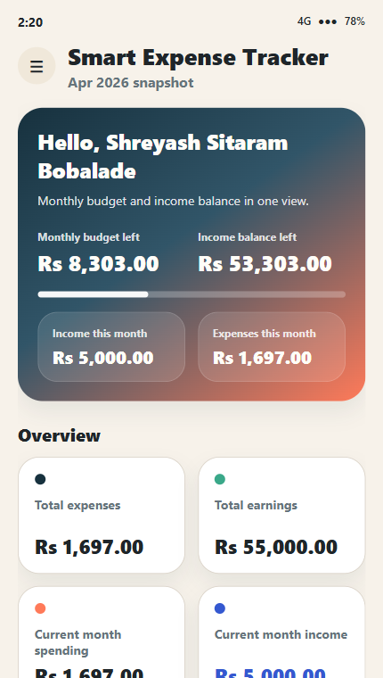
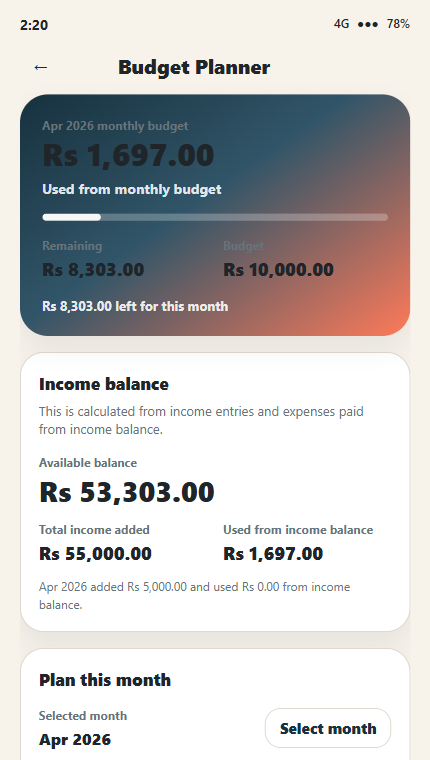
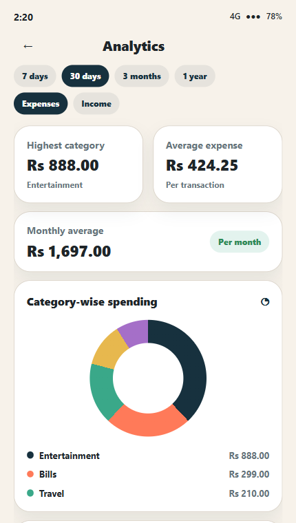
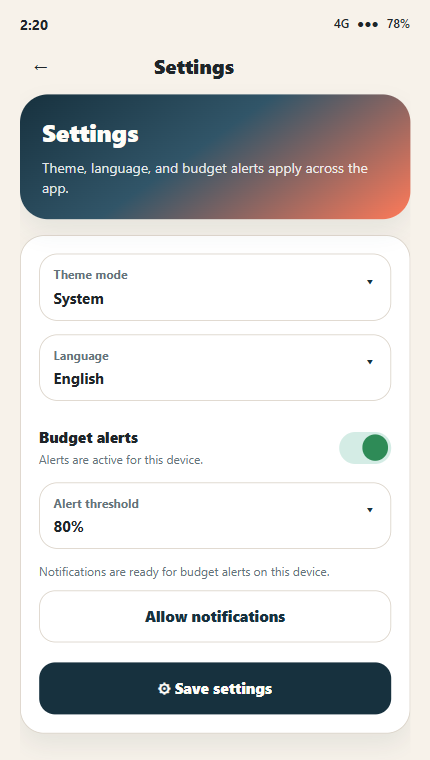

# Smart Expense Tracker

Java + XML + Firebase Android app with expense tracking, income tracking, budget planning, savings goals, analytics, PDF reports, profile management, theme/language settings, and drawer-based navigation.

## Project Structure

```text
app/src/main/java/com/example/expensetracker/
|- activities/
|  |- BaseActivity.java
|  |- SplashActivity.java
|  |- LoginActivity.java
|  |- RegisterActivity.java
|  |- DashboardActivity.java
|  |- ProfileActivity.java
|  |- AddExpenseActivity.java
|  |- EditExpenseActivity.java
|  |- ExpenseListActivity.java
|  |- AddIncomeActivity.java
|  |- EditIncomeActivity.java
|  |- IncomeListActivity.java
|  |- BudgetActivity.java
|  |- SavingsGoalActivity.java
|  |- AnalyticsActivity.java
|  |- ReportActivity.java
|  |- SettingsActivity.java
|  `- AboutActivity.java
|- adapters/
|  `- ExpenseAdapter.java
|- firebase/
|  |- FirebaseProvider.java
|  |- AuthRepository.java
|  |- UserRepository.java
|  |- ExpenseRepository.java
|  |- IncomeRepository.java
|  |- BudgetRepository.java
|  |- SavingsGoalRepository.java
|  |- DataCallback.java
|  |- ListDataCallback.java
|  `- OperationCallback.java
|- models/
|  |- UserProfile.java
|  |- Expense.java
|  |- Income.java
|  |- Budget.java
|  |- SavingsGoal.java
|  `- DashboardSummary.java
`- utils/
   |- AppConstants.java
   |- AppPreferences.java
   |- ValidationUtils.java
   |- FormatUtils.java
   |- CategoryUtils.java
   |- ExpenseAnalytics.java
   |- DropdownUtils.java
   |- NotificationHelper.java
   `- ReportPdfGenerator.java
```

## Screenshots

Generated app screen previews are available in:
- `docs/screenshots/`

Main preview files:
- `docs/screenshots/splash.png`
- `docs/screenshots/login.png`
- `docs/screenshots/dashboard.png`
- `docs/screenshots/budget.png`
- `docs/screenshots/analytics.png`
- `docs/screenshots/report.png`

Downloadable pack:
- `docs/screenshots/smart-expense-tracker-screenshots.zip`

Preview:






## Firebase Services Used

This project uses:
- Firebase Authentication
- Cloud Firestore

This project does not use:
- Firebase Storage
- Google Sign-In
- Phone OTP authentication
- Realtime Database
- Cloud Functions
- Billing / Blaze plan

## Authentication Flow

- Email/password login is the primary Firebase Auth method.
- Register collects `name + email + phone + password`.
- Login accepts `email or phone + password`.
- Phone login is not OTP. It uses a Firestore phone lookup document to resolve phone to email, then signs in with Firebase email/password.

## Exact Firebase Setup

### 1. Create Firebase project

Firebase Console:
- `Project overview -> Add app -> Android`

Use:
- Android package name: `com.example.expensetracker`
- App nickname: `Smart Expense Tracker`

Then:
- download `google-services.json`
- place it at `app/google-services.json`

### 2. Enable Authentication

Firebase Console:
- `Build -> Authentication -> Get started -> Sign-in method`

Enable:
- `Email/Password`

Keep disabled:
- `Google`
- `Phone`
- `Anonymous`
- `Email link`

Notes:
- Google Sign-In is not required for this build.
- SHA-1 / SHA-256 are optional here. They do not break email/password login if already added.

### 3. Create Firestore manually

Firebase Console:
- `Build -> Firestore Database -> Create database`

Choose:
- `Production mode`
- a region near your users

Important:
- you must create the Firestore database once manually
- collections and documents are created automatically later by the app

### 4. Firestore collections used by the app

```text
users/{uid}
users/{uid}/expenses/{expenseId}
users/{uid}/incomes/{incomeId}
users/{uid}/budgets/{monthKey}
users/{uid}/goals/{monthKey}
phone_lookup/{phone}
```

### 5. Data stored in each area

`users/{uid}`
- `userId`
- `name`
- `email`
- `phone`
- `createdAt`

`users/{uid}/expenses/{expenseId}`
- `id`
- `userId`
- `amount`
- `category`
- `note`
- `date`
- `paymentSource`

`users/{uid}/incomes/{incomeId}`
- `id`
- `userId`
- `amount`
- `reason`
- `date`

`users/{uid}/budgets/{monthKey}`
- `id`
- `userId`
- `monthKey`
- `monthLabel`
- `amount`
- `updatedAt`

`users/{uid}/goals/{monthKey}`
- `id`
- `userId`
- `monthKey`
- `monthLabel`
- `targetAmount`
- `note`
- `updatedAt`

`phone_lookup/{phone}`
- `userId`
- `email`
- `phone`

## Complete Firestore Rules

Firebase Console:
- `Build -> Firestore Database -> Rules`

Paste this full rules file:

```javascript
rules_version = '2';
service cloud.firestore {
  match /databases/{database}/documents {

    function signedIn() {
      return request.auth != null;
    }

    function isOwner(userId) {
      return signedIn() && request.auth.uid == userId;
    }

    match /users/{userId} {
      allow create, read, update, delete: if isOwner(userId);

      match /expenses/{expenseId} {
        allow create, read, update, delete: if isOwner(userId);
      }

      match /incomes/{incomeId} {
        allow create, read, update, delete: if isOwner(userId);
      }

      match /budgets/{budgetId} {
        allow create, read, update, delete: if isOwner(userId);
      }

      match /goals/{goalId} {
        allow create, read, update, delete: if isOwner(userId);
      }
    }

    match /phone_lookup/{phone} {
      allow get: if true;
      allow list: if false;

      allow create, update: if signedIn()
        && request.resource.data.userId == request.auth.uid
        && request.resource.data.phone == phone
        && request.resource.data.email is string;

      allow delete: if signedIn()
        && resource.data.userId == request.auth.uid;
    }
  }
}
```

## Important Notes About Phone Login

- `phone_lookup` is needed because this build does not use OTP login.
- The app reads `phone_lookup/{phone}` before sign-in, then logs in with the mapped email and password.
- Because of that design, the phone lookup doc is readable by direct document id.
- This is acceptable for a student project, but it is not as strong as real phone OTP authentication.

## What Firebase Creates Automatically

After the database exists, the app automatically creates:
- user profile documents
- expense documents
- income documents
- budget documents
- savings goal documents
- phone lookup documents

You do not need to manually create any collections or documents.

## Notifications

This app uses local Android notifications only.

Needed in Firebase:
- nothing extra

Needed in app:
- budget alerts can be enabled from Settings
- on Android 13+, notification permission is requested from the Settings screen

## Offline / Online Behavior

- Login and register require internet.
- Firestore data can be cached offline after it has been loaded on that device.
- A fresh install on a new device will not show old cloud data until it connects online once.
- Sharing the APK does not carry existing user data with it. Data always comes from Firebase.

## If Old Data Does Not Show On Another Device

Check these:
- the APK was built with the same `google-services.json`
- the Firebase project is the same one where your old account exists
- you are logging in, not creating a new account
- Firestore database exists in that project
- Email/Password auth is enabled
- Firestore rules are published

## Final Setup Checklist

1. Add Android app in Firebase with package `com.example.expensetracker`.
2. Replace `app/google-services.json`.
3. Enable `Email/Password` in Authentication.
4. Create Firestore in Production mode.
5. Paste and publish the Firestore rules above.
6. Sync Gradle in Android Studio.
7. Run the app.
8. Register a new account or login with an existing one.

## No Extra Firebase Setup Needed

You do not need:
- Firebase Storage
- Google Sign-In
- Phone Auth / OTP
- billing account
- Blaze plan
- Cloud Functions
- manual indexes for the current queries
